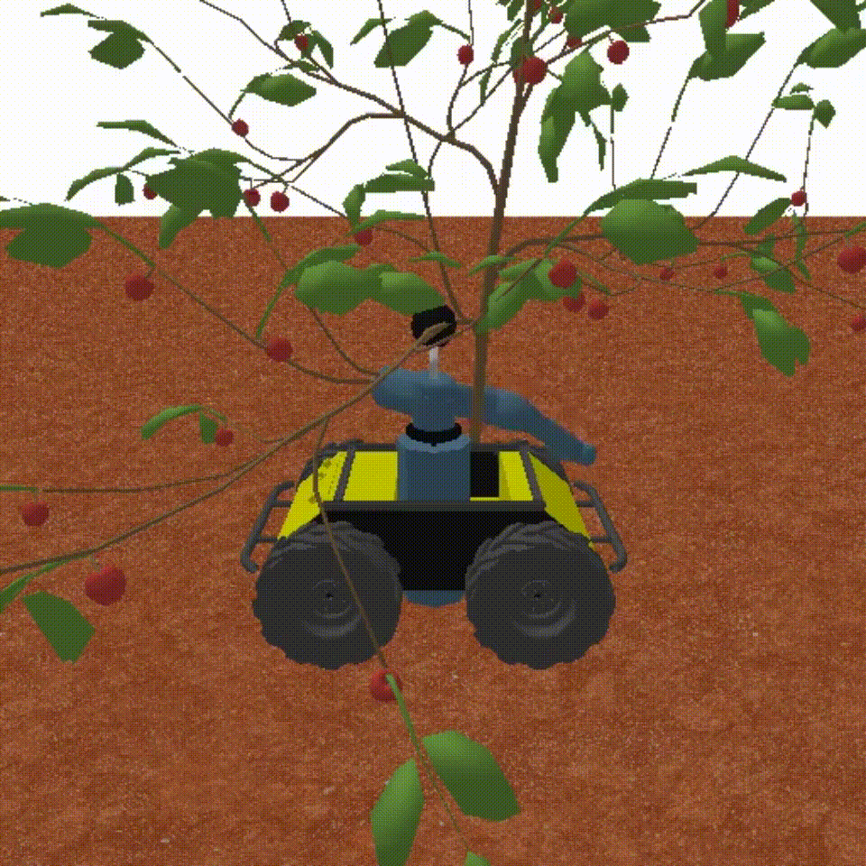

# apple-gym

*Warning: This code is messy. It's not intended to be easy to run, and I probobly wont have time to help you run it. It's shared in the hope that it will help someone, but that someone will have to be a good python programmer. If you have problems, make a well documented issue. If you like it, please help make it better by submitting a PR or contributing docs.*

A RL gym environment for picking apples from a tree with a fruit picking attachement




[more videos](https://imgur.com/a/Vq2eXui)

# Setup

```sh
git clone https://github.com/apple-gym/apple-gym.git
# make a conda environment
conda env create --file apple-gym/requirements/environment.yaml

# and the project repos, first a modified version of gym recording
git clone https://github.com/wassname/gym-recording-modified.git
pip install -e gym-recording-modified

# them diy-gym
git clone https://github.com/apple-gym/diy-gym.git
pip install -e diy-gym

# and the main repo
pip install -e apple-gym

# test
cd apple_gym
python example.py
```

# collecting demonstrations

One way to approach a hard problem like this, us using demonstrations to help a reinforcement agent learn

```sh
python collect_demonstrations.py
```

# Notes

Apple tree plant model from https://github.com/apple-gym/gen_tree_urdf (currently unreleased, please ask if you need it). They are produces  from Grove3D for blender, and converted to urdf biles that pybullet likes.
